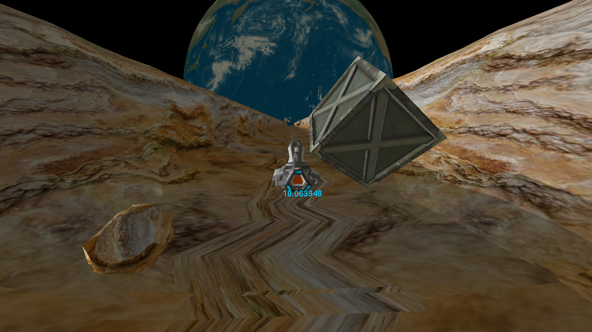
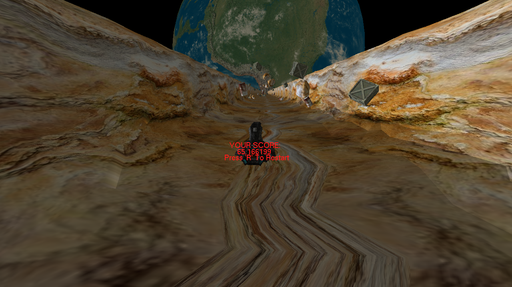
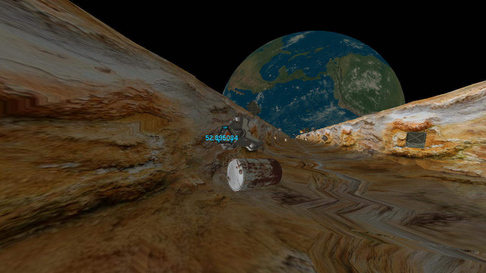

This repository contains the project files and complete source code for Starship, a simple 3D endless runner-style game which was created for a first-year Games Programming assignment at Staffordshire University using C++, OpenGL and FreeGLUT.

This project is being treated as complete, and is made public as an archive of-sorts. **Please do not send pull requests to this repository!**

# About
This project was started for the sake of an assignment during my first year at Staffordshire University for a Graphical Systems Development class, with the focus of the assignment leaning towards the implementation of various 3D graphics techniques - The biggest technical achievements of this project as a result include the implementation of a model loader capable of reading in triangulated .obj files and basic material properties for rendering in-game, as well as a texture loader capable of reading in 24 or 32-bit bitmap files.

Similar to the [Pacman](https://github.com/not-ed/pacman/) project, this also acts as a personal milestone for being the first 3D game project that has been seen to completion without the use of a proprietary game engine such as Unity or Unreal Engine.

# Requirements
Both the necessary [OpenGL](https://www.opengl.org//) and [FreeGLUT](http://freeglut.sourceforge.net/) files are already contained within the Project Folder under the **x86** configuration in Visual Studio - Simply pull down the repository and open the Project Solution file, you may want to double-check that the configuration is also set to x86 in the IDE before attempting to build and run to save any headaches.

If you are **NOT** using the x86 configuration, you will need to ensure that the appropriate OpenGL and FreeGLUT files are included within the project folder for your desired configuration in order it to build and run.

# Screenshots

